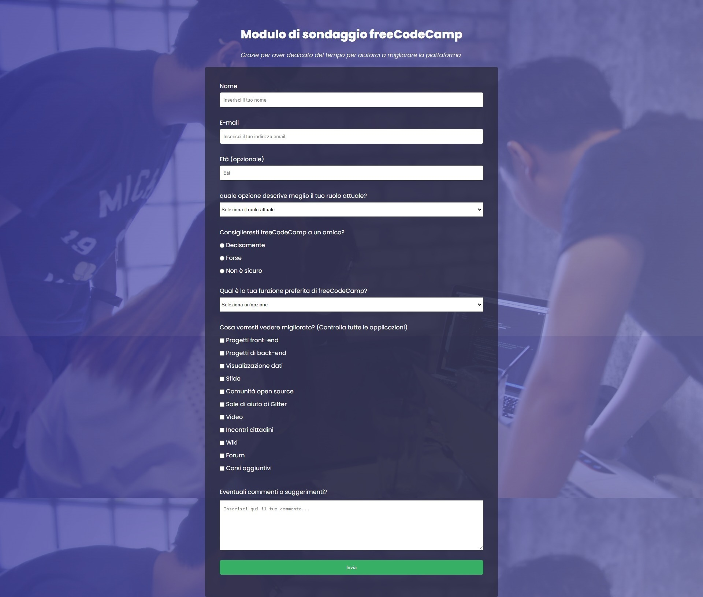
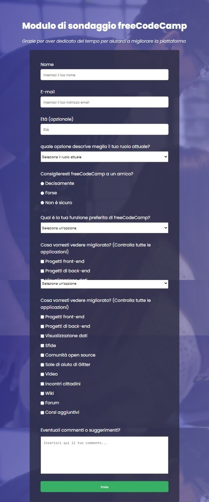

# freeCodeCamp - Soluzione del form survey

[Anteprima del design per la sfida di survey form](https://survey-form.freecodecamp.rocks/)

## Panoramica

- [Overview](#overview)
  - [The challenge](#the-challenge)
  - [Screenshot](#screenshot)
  - [Links](#links)
- [My process](#my-process)
  - [Built with](#built-with)
  - [What I learned](#what-i-learned)
  - [Useful resources](#useful-resources)
- [Author](#author)

## Benvenuto! 👋

Questo è uno dei progetti necessari per ottenere la certificazione di web design con freeCodeCamp.

In questo progetto, creerò un modulo di sondaggio per raccogliere dati daigli utenti.

**Per affrontare questa sfida, è necessaria una comprensione di base di HTML e CSS.**

**La parte javascript è stata aggiunta di mia iniziativa**

## La sfida

La sfida è costruire un form quanto più simile a quello di freeCodeCamp

Ho voluto aggiungere anche la parte javascript per provare per la prima volta a manipolare i dati ricevuti da un form.

### Screenshot

### Links

- [URL della soluzione](https://github.com/Smailen5/sfida-free-code-camp?tab=readme-ov-file)
- [URL del sito live](https://smailen5.github.io/sfida-free-code-camp/)

## Dove trovare tutto

Ho seguito il design di [Anteprima del design per la sfida di survey form](https://survey-form.freecodecamp.rocks/), da cui ho preso l'immagine di background e la pallet di colori.

## Il mio processo

### Costruito con

- HTML5 semantico
- Proprietà personalizzate CSS
- Flexbox
- JavaScript

### Cosa ho imparato

Ho imparato a usare un `forEach` per inserire i dati del form all'interno di un oggetto e con `console.table()` stampare i valori in console sotto forma di tabella che è più facile da leggere.

### Risorse utili

- [Risorsa freeCodeCamp](https://www.freecodecamp.org/italian/learn/2022/responsive-web-design/) - Ho cercato di usare tutto quello che ho imparato dalla prima sezione del corso responsive web design.

## Autore

- Github - [Smailen5](https://github.com/Smailen5)
- Frontend Mentor - [@ Smailen5](https://www.frontendmentor.io/profile/Smailen5)
- Linkedin - [Smailen Vargas](https://www.linkedin.com/in/smailen-vargas/)
- freeCodeCamp - [Smailen Vargas](https://www.freecodecamp.org/italian/fcc54c189ea-4b3d-4832-afe3-868235883a3c)
